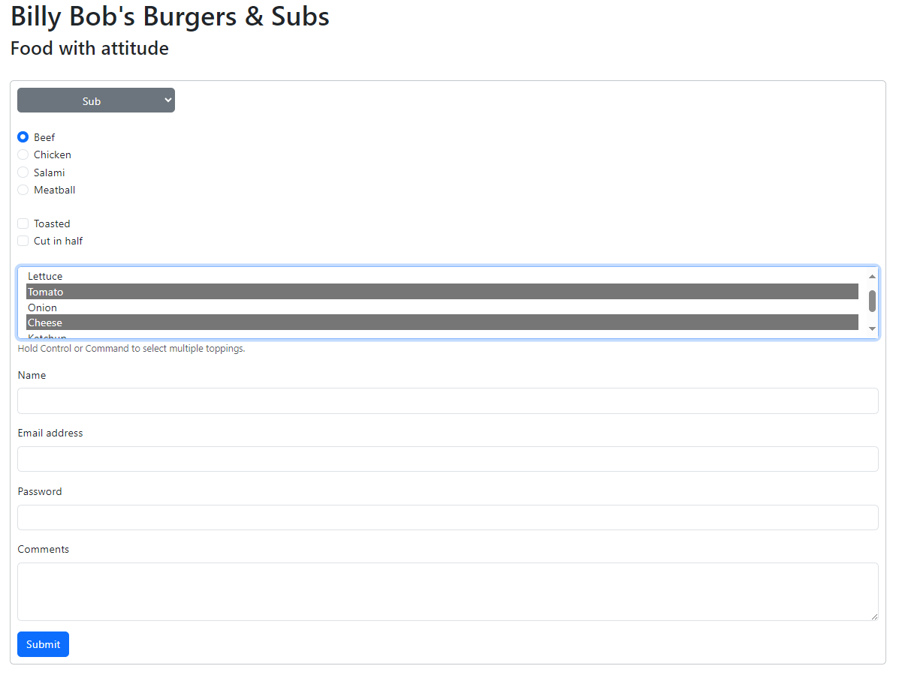

# Restaurant-Order-Form
 A basic HTML form exercise for practicing HTML, CSS and Bootstrap.

<b>Thomas Proudfoot\
Billy Bob's Burgers & Subs Restaurant Order Form Assignment\
03/11/2024</b>

Please note that to view all form elements, you must view both the burger and the sub in the dropdown. This is because the page dynamically updates the form to only reflect the options that are applicable to the given menu item.

Site is hosted here: https://proudfootdk.github.io/Billy-Bob-Restaurant-Order-Form/

